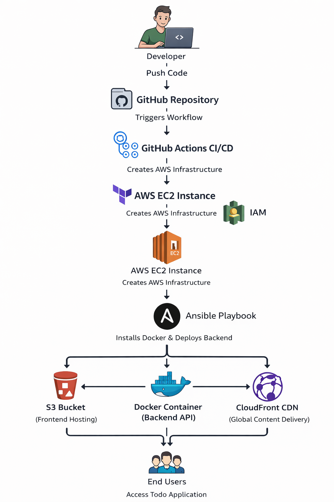

# DevOps Todo Application

This project demonstrates a complete CI/CD pipeline using GitHub Actions, Terraform, Ansible, Docker, and AWS.

## Architecture Diagram

## Pipeline Workflow

Developer Push Code  
↓  
GitHub Actions CI/CD  
↓  
Terraform (Infrastructure Creation)  
↓  
AWS EC2 Instance  
↓  
Ansible (Server Configuration)  
↓  
Docker Container (Backend API)  
↓  
S3 Bucket (Frontend Hosting)  
↓  
CloudFront CDN  
↓  
Users Access Application
